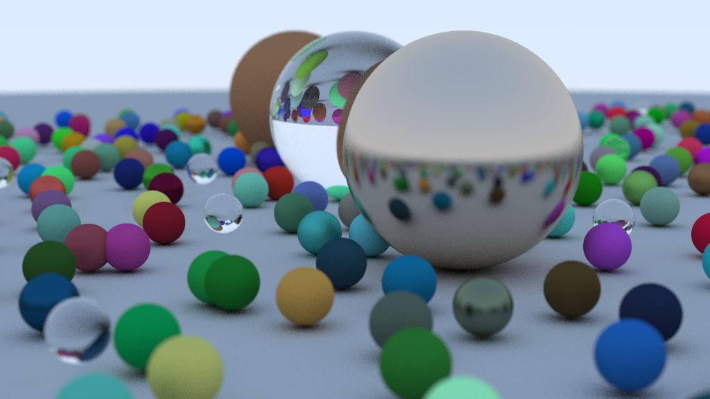

# forth-raytracing

Implimentation of [Ray Tracing in One Weekend Series](https://raytracing.github.io/)(日本語翻訳: [週末レイトレーシング (翻訳) - inzkyk.xyz](https://inzkyk.xyz/ray_tracing_in_one_weekend/)) with Forth.

## Example

## Prerequisites

- [gforth](https://gforth.org/) 0.7.9 or later
- A graphic software which can read PNM format

## Getting started

1. Configure the image size in [main.fs](src/main.fs) (Recomend 192x108 first)
2. `make run`

## License

This code is under the [BSD Zero Clause License](LICENSE)